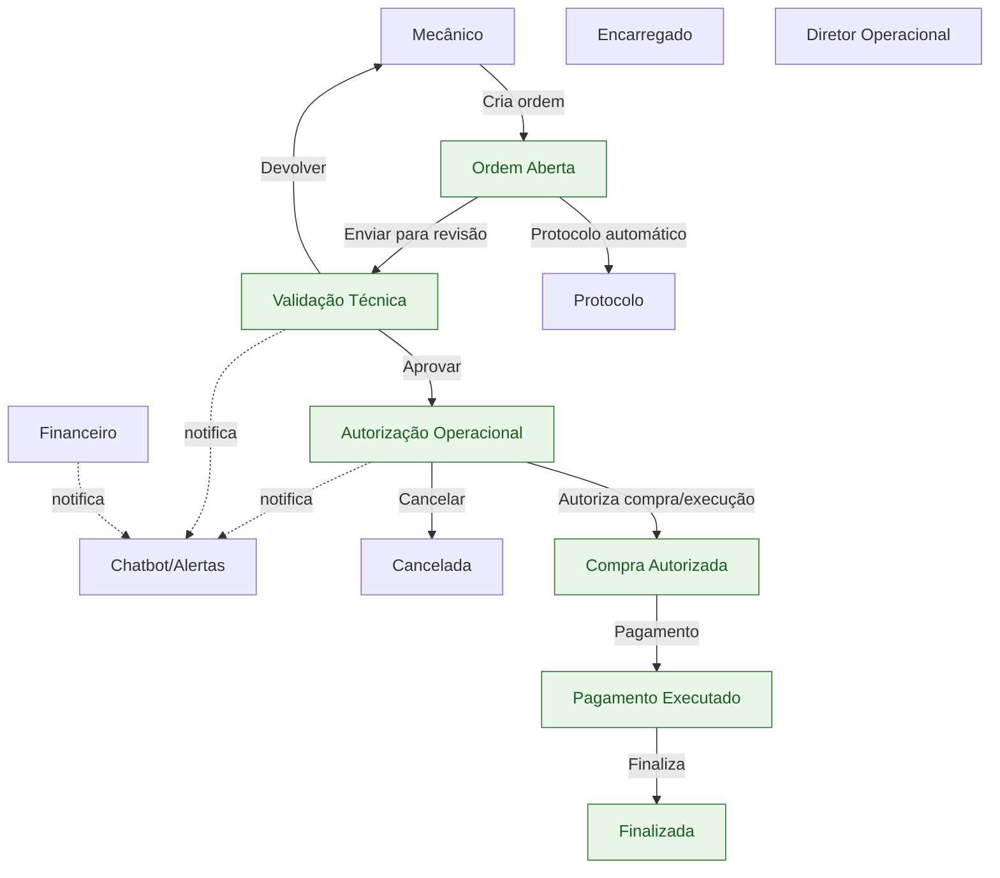

# Fluxograma Operacional e Hierárquico — Ordem de Manutenção

Este fluxograma representa o fluxo digital de autorizações e execução entre os níveis: Mecânico → Encarregado → Diretor Operacional → Financeiro, com notificações via Chatbot.

Legenda

- Protocolo: gerado automaticamente ao criar a ordem.
- Devolver: Encarregado solicita ajustes ao Mecânico com observações.
- Cancelar: permitido ao Diretor ou Financeiro com motivo obrigatório (auditado).
- Chatbot: envia alertas diários, solicita aprovação rápida e consolida resumos.

Observações

- Cada transição é auditada (usuário, papel, horário, motivo).
- Regras de permissão por módulo variam conforme papel (ver documentação).
